# HKPUG-Meetup85-AgenticWorkflow

This repository contains the materials for the HKPUG Meetup #85, which took place on 2025-04-26 in Auki Lab, Hong Kong.

To run the code in the repository, you need to have the following dependencies installed:
- Python 3.11 or higher

This workshop utilizes [Pydantic AI](https://ai.pydantic.dev/) to create an agentic workflow for data processing and analysis. The goal is to demonstrate how to use Pydantic AI to create a workflow that uses multiple tools in multiple steps, and incorporates the Actor-Critic paradigm to improve the performance of the workflow.

## Installation

1. Clone the repository:
    ```bash
    git clone https://github.com/alex-au-922/HKPUG-Meetup85-AgenticWorkflow.git
    cd HKPUG-Meetup85-AgenticWorkflow
    ```

2. Install the required dependencies:
    ```bash
    python -m pip install -r requirements.txt
    ```

3. Run the jupyter notebook in the `notebooks` directory:


## LLM

This workshop uses the `fireworks.ai` service to run the LLM. If you have your own LLM service, you can modify the notebook according to the [documentation](https://ai.pydantic.dev/models/) from Pydantic AI.

If you want to use the `fireworks.ai` service, you need to create an account and get your API key, and paste the key into the beginning of each notebook.

```python
API_KEY = '<enter your API key>'  # Change this to your API key
```

## Data

The data used in this workshop are generated synthetically. The data has the schema as:

